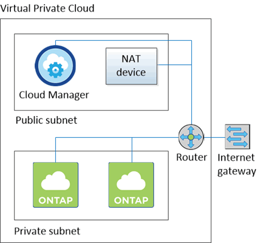

= Getting started with ONTAP Cloud in AWS
:toc: macro
:toclevels: 1
:hardbreaks:
:doctype: book
:nofooter:
:icons: font
:linkattrs:
:linkcss:
:stylesheet: pages/cloud_manager/netapp.css
:description: Describes how to get started with NetApp ONTAP Cloud in AWS so you can use enterprise-class features for your cloud storage and easily replicate data across your hybrid cloud.
:keywords: ontap, ontap cloud, amazon web services, aws, netapp, data fabric, hybrid cloud, cloud, public cloud, networking, marketplace, oncommand, cloud manager, ebs, ec2, disk, vpc, quick, getting started, install, installing, deploy, deploying, setup, setting up, launching, requirements, prerequisites, cloud data services

ONTAP Cloud provides enterprise-class features for your cloud storage and gives you a universal storage platform that enables you to easily replicate data across your hybrid cloud. You must launch and manage ONTAP Cloud using OnCommand Cloud Manager software.

You should use this document if you want to get Cloud Manager and ONTAP Cloud up and running quickly using the NetApp Cloud Data Services Portal, and you do not want to read conceptual background and explore every available option.

toc::[]

== Preparing your AWS environment
[.lead]
Before you can deploy Cloud Manager and ONTAP Cloud in AWS, you need to prepare your networking, attach an IAM policy to an IAM user, and subscribe to ONTAP Cloud from the AWS Marketplace.

.Steps
. Choose the AWS VPC and subnets in which you want to launch the Cloud Manager instance and ONTAP Cloud instances.
+
At a minimum, your networking must meet the following requirements:
[square]
* The target VPC must have one or more subnets that have outbound internet access.
* To deploy ONTAP Cloud systems in subnets or networks separate from Cloud Manager, connections between those networks must be in place.
* To replicate data across a hybrid cloud or multi-cloud environment, VPN connections between networks must be in place.
* To reduce storage costs by using EBS as a performance tier and AWS S3 as a capacity tier, the VPC in which you launch ONTAP Cloud must have an endpoint to the S3 service.
+
The following sample VPC configuration shows public and private subnets and a NAT device that enables outbound internet access for the private subnet:
+

. Grant a specific set of AWS permissions to the IAM user that you plan to use when deploying Cloud Manager from the NetApp Cloud Data Services Portal:
.. From the AWS IAM console, create your own policy by copying and pasting the contents of the https://mysupport.netapp.com/cloudontap/iampolicies[NetApp Cloud Data Services IAM policy^].
.. Attach the policy that you just created to the IAM user.
+
The following video shows this process.
+
video::media/occm_aws_portal_policy.mp4[width=780, height=442]

. Subscribe to ONTAP Cloud in AWS:
.. Go to the AWS Marketplace pages for ONTAP Cloud:
[square]
* http://aws.amazon.com/marketplace/pp/B011KEZ734[ONTAP Cloud for AWS (PayGo)^]
* http://aws.amazon.com/marketplace/pp/B00OMA46T0[ONTAP Cloud for AWS (BYOL)^]
* http://aws.amazon.com/marketplace/pp/B01H4LVJ84[ONTAP Cloud for AWS - High Availability (PayGo)^]
* http://aws.amazon.com/marketplace/pp/B01H4LVJUC[ONTAP Cloud for AWS - High Availability (BYOL)^]

.. Click *Continue*, review the terms, and then click *Accept Software Terms*.
+
IMPORTANT: You must not launch ONTAP Cloud instances from the AWS Marketplace. You must use OnCommand Cloud Manager to launch ONTAP Cloud in AWS.

**Result**

Your environment is ready to deploy Cloud Manager and ONTAP Cloud.

== Launching Cloud Manager in AWS
[.lead]
You need to install and set up Cloud Manager so you can use it to launch ONTAP Cloud in AWS.

.Steps
. Go to the https://cloud.netapp.com[NetApp Cloud Data Services Portal^] and sign up or log in.
. Under *ONTAP Cloud*, click *Start Free Trial*.
. Follow the prompts to deploy the Cloud Manager instance and software in AWS.
+
You should keep the page open until the deployment is complete. The portal redirects you to the Cloud Manager system when it is available.
+
NOTE: If a proxy server is required for internet connectivity in the subnet, Cloud Manager prompts you to add the proxy details.
+
The following video shows how to launch Cloud Manager.
+
video::media/portal_occm_deploy.mp4[width=780, height=442]

**Result**

Cloud Manager is now installed and set up so users can launch ONTAP Cloud instances.

== Launching ONTAP Cloud in AWS
[.lead]
You can launch ONTAP Cloud in AWS to provide enterprise-class features for your cloud storage. You can choose a single-node configuration, or an HA pair to provide nondisruptive operations and fault tolerance in AWS.

.Steps

. On the Working Environments page in Cloud Manager, click *Create*.

. Under Create, select *ONTAP Cloud* or *ONTAP Cloud HA*.

. Complete the steps in the wizard to launch the instance.
+
Note the following as you complete the wizard:
[square]
* The predefined security group includes the rules that ONTAP Cloud needs to operate successfully.
* The underlying AWS disk type is for the initial ONTAP Cloud volume. You can choose a different disk type for subsequent volumes.
* The performance of AWS disks is tied to disk size. You should choose the disk size that gives you the sustained performance that you need.
+
http://docs.aws.amazon.com/AWSEC2/latest/UserGuide/EBSVolumeTypes.html[AWS Documentation: Amazon EBS Volume Types^]
* The disk size is the default size for all disks on the system.
+
TIP: If you need a different size later, you can use the *Advanced allocation* option to create an aggregate that uses disks of a specific size.
+
The following video shows how to launch a single-node configuration.
+
video::media/occm_launch_otc.mp4[width=780, height=442]

**Result**

Cloud Manager launches the ONTAP Cloud instance in AWS. The instance should be ready in approximately 25 minutes. You can track the progress in the timeline.
