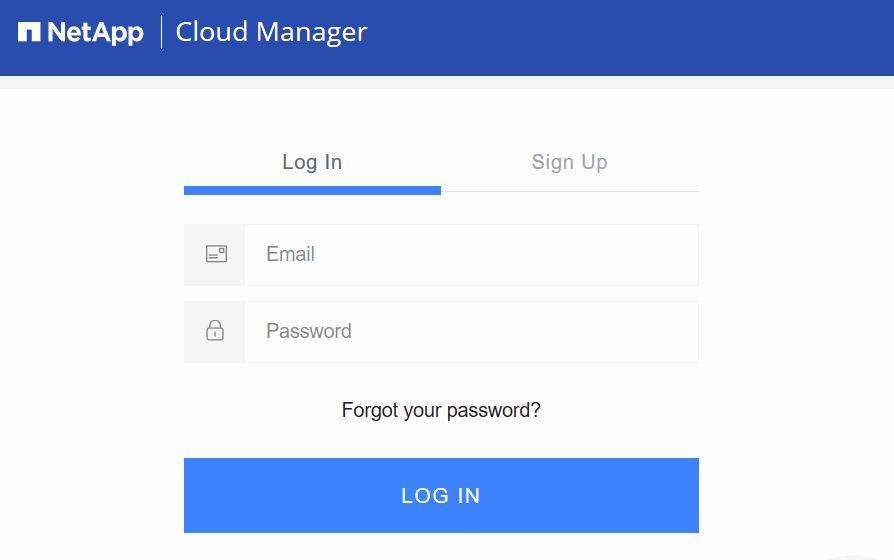

= Logging in to Cloud Manager
:hardbreaks:
:doctype: book
:nofooter:
:icons: font
:linkattrs:
:linkcss:
:stylesheet: netapp.css
:keywords: cloud manager, logging in, log in, cloud data services

You can log in to Cloud Manager from any web browser that has a connection to the Cloud Manager system. For new Cloud Manager 3.4 systems and later, you must have a NetApp Cloud Data Services Portal user account to log in.

.Steps
. Open a web browser and enter the following URL:
+
https://_ipaddress_:__port__
+
_ipaddress_ can be localhost, a private IP address, or a public IP address, depending on the configuration of the Cloud Manager host. For example, if Cloud Manager is in the public cloud without a public IP address, you must enter a private IP address from a host that has a connection to the Cloud Manager host.
+
_port_ is required if you changed the default HTTP (80) or HTTPS (443) ports. For example, if the HTTPS port was changed to 8443, you would enter https://ipaddress:8443
+
After you enter the URL, the Cloud Manager log in screen appears. The following image shows the log in screen for new Cloud Manager 3.4 systems and later.
+

. If you do not have a NetApp Cloud Data Services Portal user account, you must sign up for one and then the Cloud Manager administrator must add your account to the system before you can log in.
