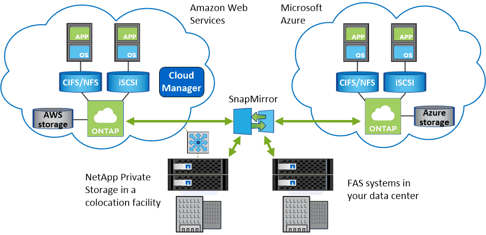

= OnCommand Cloud Manager overview
:hardbreaks:
:doctype: book
:nofooter:
:icons: font
:linkattrs:
:linkcss:
:stylesheet: netapp.css
:keywords: oncommand, cloud manager, overview, concepts, understanding, how, storage system, volume view

OnCommand Cloud Manager enables you to deploy ONTAP Cloud systems, which provide enterprise-class features for your cloud storage, and to easily replicate data across hybrid clouds built on NetApp.

Cloud Manager provides two management views in standard Amazon Web Services (AWS) regions: the Storage System View and the Volume View. The Storage System View is the default view for Microsoft Azure and the AWS GovCloud (US) region.

*Storage System View*

You can use Cloud Manager in this view to have full control of ONTAP Cloud systems:
[.square]
* Configure and launch ONTAP Cloud instances in AWS and in Azure
* Provision NFS and CIFS storage
* Replicate data across a hybrid cloud and multi-cloud environment: between ONTAP clusters, ONTAP Cloud systems, and NetApp Private Storage for Cloud configurations
* Manage ONTAP Cloud systems as needed, which includes capacity allocation decisions, simplified upgrades, cost monitoring, and several other tasks

*Volume View*

The Volume View enables you to simply specify the NFS volumes that you need in AWS and then Cloud Manager handles the rest: it deploys ONTAP Cloud systems as needed and it makes capacity allocation decisions as volumes grow. This view gives you the benefits of enterprise-class storage in the cloud with very little storage management.

*Where to deploy Cloud Manager*

Cloud Manager can run in the cloud or in your network—it just needs a connection to the networks in which you want to deploy ONTAP Cloud systems.

The following image shows Cloud Manager running in AWS and managing ONTAP Cloud systems in AWS and Azure. It also shows data replication across a hybrid cloud.

